# Abul Basar — Portfolio

### 🔗 Live site: **[portfolio-assignment-pink-ten.vercel.app](https://portfolio-assignment-pink-ten.vercel.app)**

## About the project

A personal portfolio website, built as a web development assignment. It introduces who I am as a software engineer — my background, education, skills, projects, work experience and how to contact me — on a single, fully responsive page.

The site is built from scratch with Next.js, TypeScript and Tailwind CSS (no page builders or templates), with an editorial design, light and dark themes, and subtle scroll animations.

**Sections:** Home · About Me · Education · Skills · Projects · Experience & Activities · Contact

## Screenshots

### Home — landing page

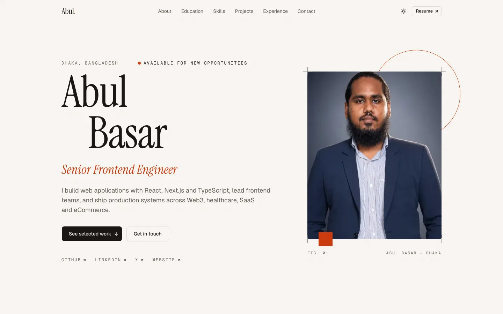

### About Me

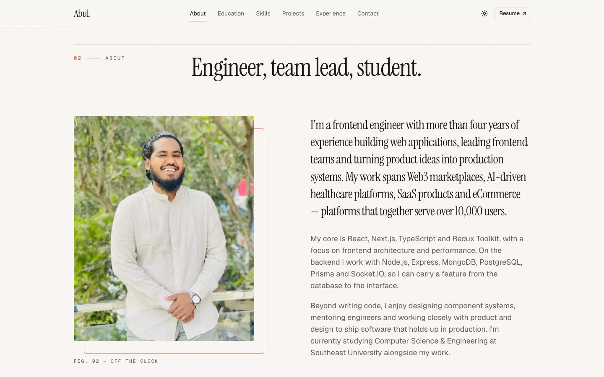

### Education

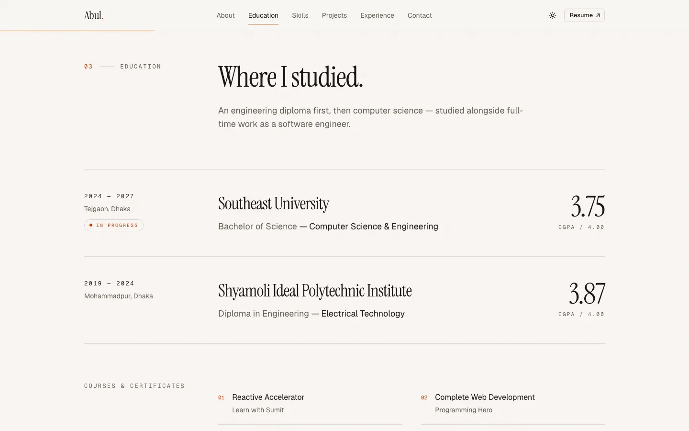

### Skills

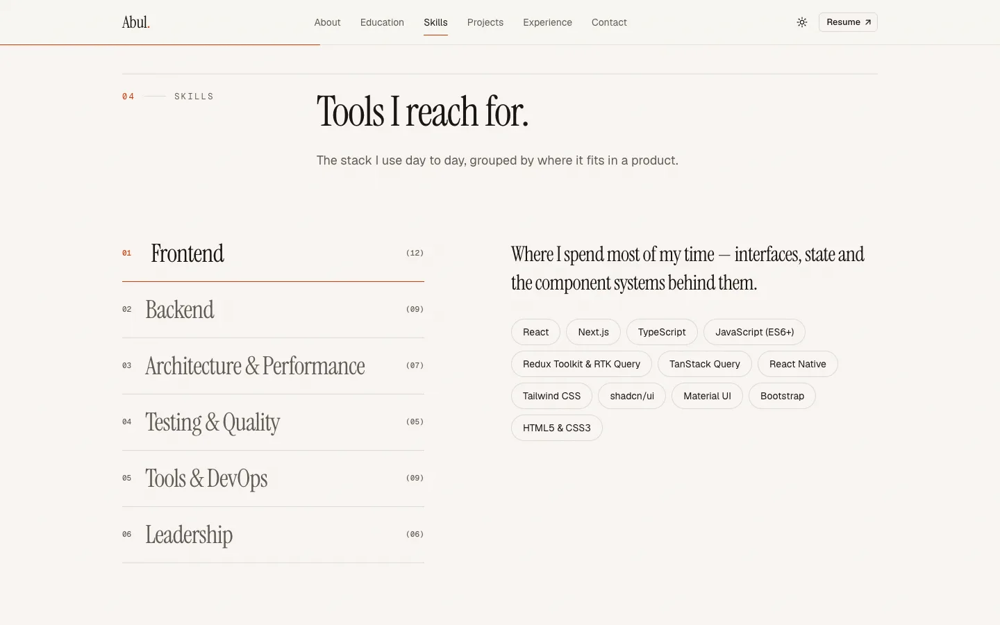

### Projects

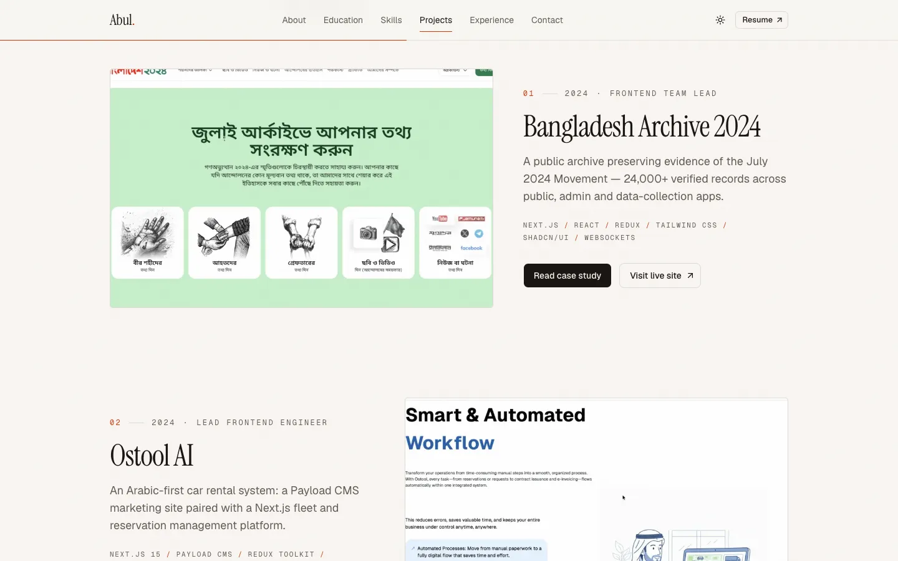

**Project case study** — each project opens a detailed view with a screenshot gallery, the challenge, approach and outcome.

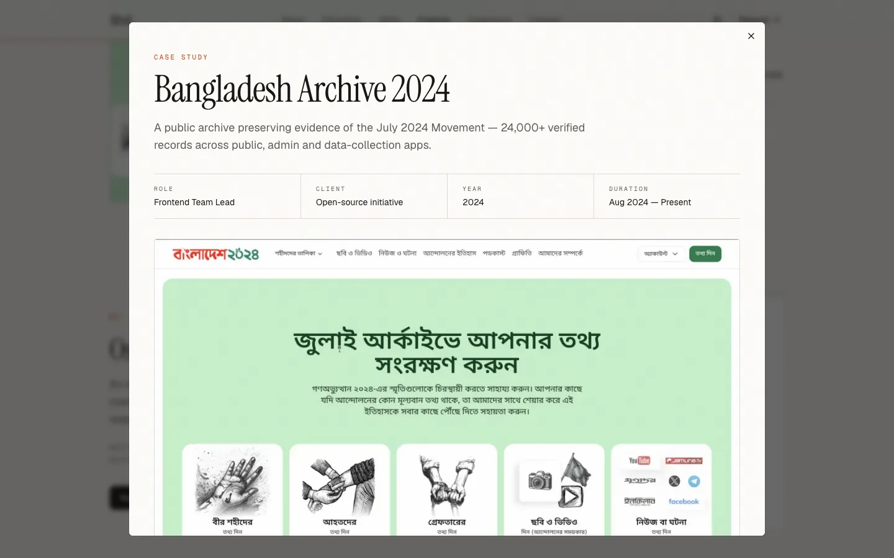

### Experience & Activities

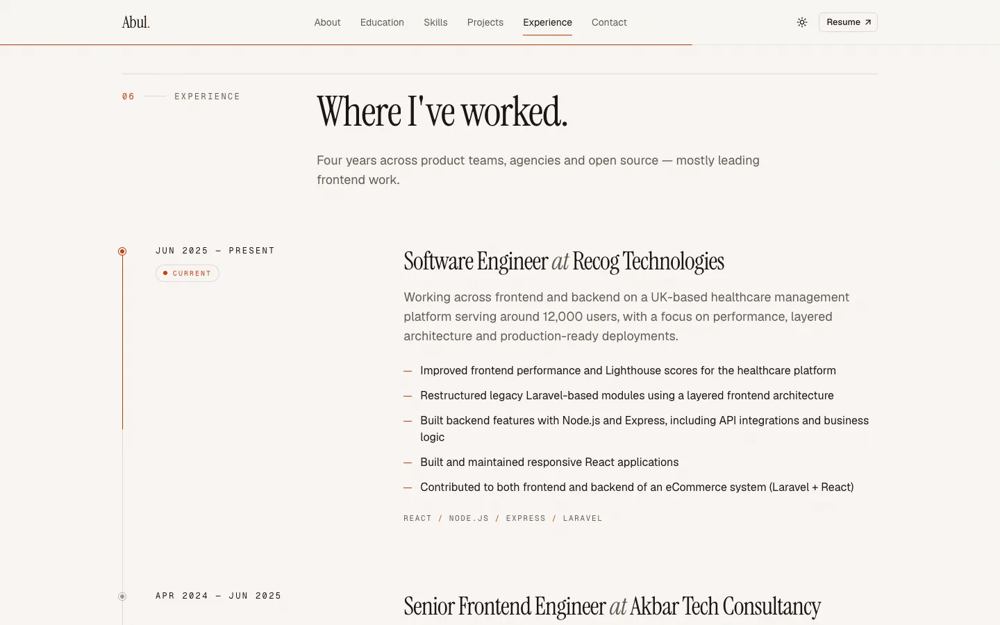

### Contact

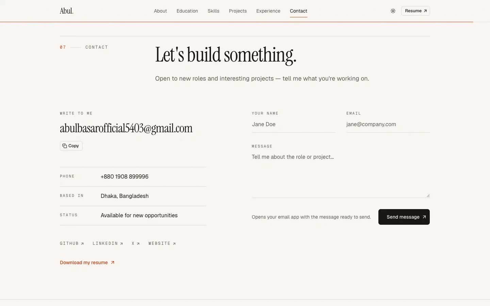

### Dark theme

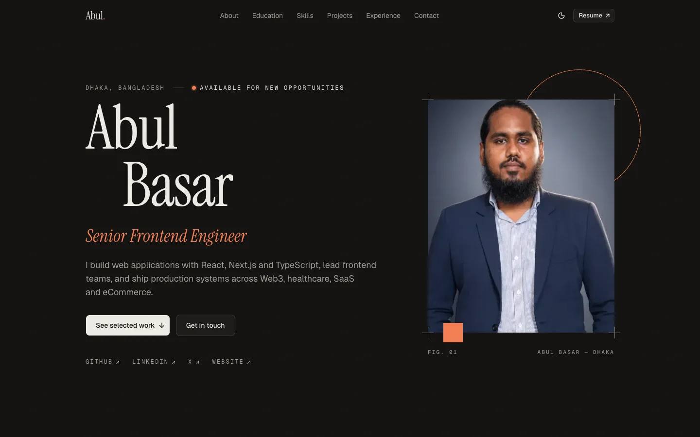

### Mobile

<table>
  <tr>
    <td align="center">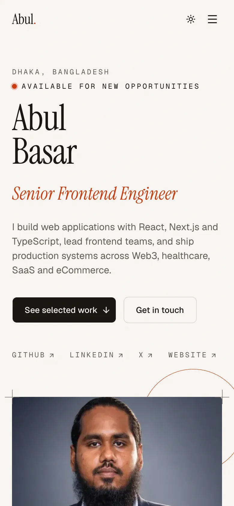<br /><sub>Home</sub></td>
    <td align="center">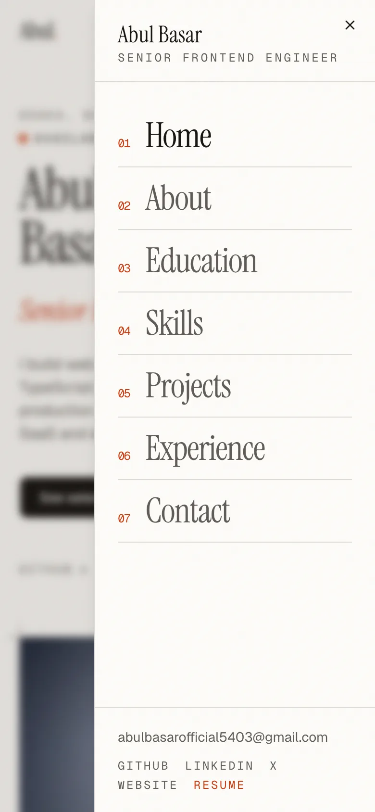<br /><sub>Navigation menu</sub></td>
    <td align="center">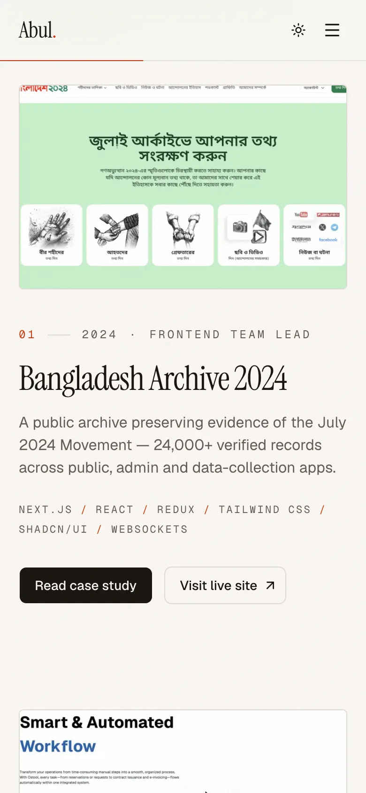<br /><sub>Projects</sub></td>
  </tr>
</table>

## Features

- Single page with smooth-scrolling section navigation and active-section highlighting
- Light and dark themes that follow the system setting
- Scroll-triggered animations that respect the "reduce motion" accessibility setting
- Project case studies in an accessible dialog with a screenshot gallery
- Certificate previews, an interactive skills explorer and a work timeline
- Validated contact form that opens the visitor's email app with the message prefilled
- Fully responsive from small phones to large desktops

## Quality

Lighthouse (production build, local):

| Category       | Mobile | Desktop |
| -------------- | ------ | ------- |
| Performance    | 95     | 99      |
| Accessibility  | 100    | 100     |
| Best Practices | 100    | 100     |
| SEO            | 100    | 100     |

Also included: Open Graph share image, sitemap, robots.txt, web app manifest, structured data (schema.org `Person`) and a custom 404 page.

## Tech stack

- [Next.js](https://nextjs.org) (App Router) + TypeScript
- Tailwind CSS v4 with light / dark theme tokens
- [shadcn/ui](https://ui.shadcn.com) on Radix primitives
- [Motion](https://motion.dev) for scroll and text animations (respects reduced-motion)
- next-themes, lucide-react
- react-hook-form + zod for form validation
- Fonts: Instrument Serif, Geist, Geist Mono (via `next/font`)
- ESLint

## Editing content

All text and image references live in `src/data/`. Update those files to change what the site shows — components never hardcode personal details.

## Getting started

Requires Node.js 20+ and pnpm.

```bash
pnpm install
pnpm dev        # http://localhost:3000
```

## Scripts

| Command       | Description                  |
| ------------- | ---------------------------- |
| `pnpm dev`    | Start the development server |
| `pnpm build`  | Create a production build    |
| `pnpm start`  | Serve the production build   |
| `pnpm lint`   | Run ESLint                   |
| `pnpm format` | Format code with Prettier    |

## Project structure

```text
src/
  app/          layout, page, 404, metadata routes (sitemap, robots, manifest, OG image)
  assets/og/    font and photo used to render the share image
  components/
    ui/         shadcn/ui primitives
    layout/     navbar, mobile menu, theme toggle, container, section heading
    motion/     reusable animation wrappers (Reveal, Stagger, TextReveal)
    sections/   page sections: hero, about, education, skills, projects, experience, contact
    seo/        structured data
    shared/     small shared pieces (social links)
    providers/  theme and motion providers
  hooks/        client hooks (active section, mounted, parallax)
  data/         all site content (profile, education, experience, projects, skills…)
  lib/          utilities, motion presets, site URL
  types/        shared TypeScript types
public/
  images/       profile photos, project screenshots, certificates (WebP)
docs/
  screenshots/  README screenshots (desktop and mobile)
```

## Deployment

The site is a fully static Next.js build, deployed on [Vercel](https://vercel.com):

1. Import the GitHub repository in Vercel — the default Next.js settings work as-is.
2. Optionally set `NEXT_PUBLIC_SITE_URL` to a custom domain; otherwise the Vercel production URL is used for metadata, the sitemap and the share image.
